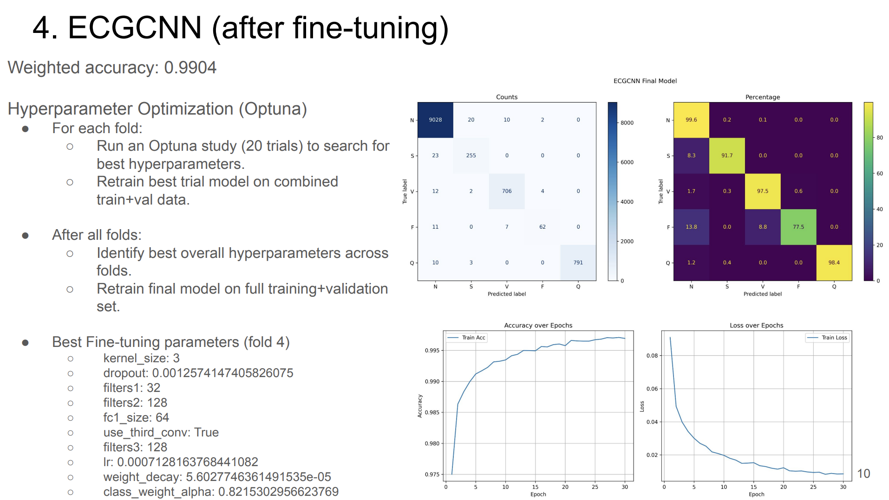

# MIT-BIH Arrhythmia Classification 

This project implements deep learning models to classify heartbeats in the MIT-BIH Arrhythmia dataset. It includes full preprocessing, optional data augmentation, model training, hyperparameter tuning using Optuna, and evaluation with cross-validation. The models supported are CNN-based and transformer-based architectures.

---
## Key Slides

### Summary of the Project


### Project Flow Chart


### Fine-Tuned Model Results


###  Full Presentation
You can view all 11 slides here: [Google Slides link](https://docs.google.com/presentation/d/1-wcSTJ1W-nOafntYNnrFyszWSPdyJ72lb4nRjgDH5Lk/edit?usp=sharing)

---

## Project Structure

```
├── main.py                # Main training and evaluation pipeline
├── model_definitions.py   # CNN and Transformer model architectures
├── train_utils.py         # Training utilities and loss functions
├── optuna_utils.py        # Hyperparameter tuning with Optuna
├── preprocessing.py       # Data preprocessing and beat extraction
├── predict.py             # Script for predicting new ECG beats
├── run_demo.py            # Demo script: save sample beats, predict, and plot
├── config.py              # Hyperparameters, dataset paths, and constants
├── utils.py               # General utility functions (seed setting, exports)
├── README.md              # This file
└── /data                  # Raw and processed datasets
```

---
## Early Exploratory Work

Before implementing augmentation and k-fold cross-validation in the modularized `.py` scripts,  
I carried out initial experiments in a Jupyter Notebook:  
- Basic preprocessing (filtering, normalization, DataLoader setup)  
- First model prototypes (AcharyaCNN, ECGCNN, LSTM, iTransformer)  
- Training and evaluation without augmentation or k-fold  
- Confusion matrices, per-class performance visualizations  

You can find the notebook here: [`notebook.ipynb`](notebook.ipynb)  

---

##  Models

Implemented:
- AcharyaCNN (baseline model from literature)
- ECGCNN (custom enhanced CNN)
- iTransformer (attention-based architecture)

Evaluation metrics include:
- Accuracy
- Confusion matrix
- Per-class precision & recall
- Cross-validation (5-fold)

---

##  Training Details

- **Dataset:** MIT-BIH Arrhythmia Dataset (beats segmented into 260-sample windows)
- **Input shape:** `(batch_size, 1, 260)` (single channel ECG beats)
- **Loss Function:** CrossEntropyLoss with optional soft class weighting
- **Optimizer:** Adam
- **Data Augmentation:** Optional random rescaling and jitter on training beats
- **Hyperparameter Tuning:** Optuna with search over learning rate, dropout, weight decay, and class weight smoothing

---

##  Results Summary

| Model         | Augmentation | Weighted Accuracy      |
|---------------|--------------|------------------------|
| AcharyaCNN    | Yes          |  98.10%                |
| ECGCNN        | Yes          |  **98.91%**            |
| iTransformer  | Yes          |  97.36%                |

>  *ECGCNN with augmentation shows the best overall performance.*

---

## Usage

### 1. Install dependencies
```bash
pip install -r requirements.txt
```

### 2. Train a model
```bash
python main.py 
```

### 3. Run Optuna tuning
```bash
python -c "from optuna_utils import run_optuna_study; run_optuna_study(train_loader, val_loader, n_trials=30)"
```

### 4. Predict new data
```bash
python predict.py
```

### 5. Run demo visualization
```bash
python run_demo.py
```

---

## Hyperparameter Tuning (Optuna)

Search space includes:
- Learning rate (lr)
- Dropout rate (dropout)
- Weight decay (weight_decay)
- Class weight smoothing parameter (class_weight_alpha)
- Number of convolution filters, kernel sizes, fully connected layer sizes, and use of third conv layer for the ECGCNN model


---

## References
- [MIT-BIH Dataset](https://www.physionet.org/content/mitdb/1.0.0/)
- [Acharya et al., “A deep convolutional neural network model to classify heartbeats”, 2017.](https://www.sciencedirect.com/science/article/abs/pii/S0010482517302810)
- [Optuna: A hyperparameter optimization framework](https://optuna.readthedocs.io/en/stable/)
- ChatGPT  was used to assist with code optimization and documentation.

---
##  Author

- **Hsiu-Hsien (Leo) Lin**
- [hhlin.work@gmail.com](mailto:hhlin.work@gmail.com)
- [GitHub](https://github.com/hsiuhsil)
- [LinkedIn](https://www.linkedin.com/in/hsiuhsil/)
