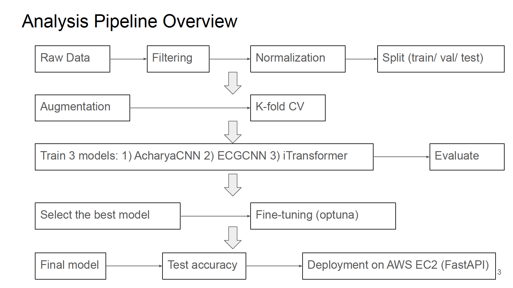

# MIT-BIH Arrhythmia Classification 


This project implements deep learning models to classify heartbeats in the MIT-BIH Arrhythmia dataset. It includes full preprocessing, optional data augmentation, model training, hyperparameter tuning using Optuna, and evaluation with cross-validation. The models supported are CNN-based and transformer-based architectures.

---
## My Contributions

This project was **independently implemented from scratch** (not forked).  
Specifically, I built and documented:

- **Full data pipeline**: preprocessing, augmentation (`augmenter.py`), and custom dataloaders.  
- **Custom model design**: implemented **ECGCNN**, an enhanced CNN architecture that outperforms existing baselines.  
- **Training framework**: utilities for training loops, metrics, logging, and visualization.  
- **Hyperparameter tuning**: integrated **Optuna** for automated search over CNN/Transformer configs.  
- **Experiment tracking**: reproducible experiments via scripts and results saving.  
- **Presentation & results**: slides summarizing methodology and evaluation.

Baselines (e.g., AcharyaCNN) were reimplemented from literature for comparison, but all code in this repository was written by me.

---
## Key Slides

### Summary of the Project


### Project Flow Chart


### Fine-Tuned Model Results


###  Full Presentation
You can view all 11 slides here: [Google Slides link](https://docs.google.com/presentation/d/1-wcSTJ1W-nOafntYNnrFyszWSPdyJ72lb4nRjgDH5Lk/edit?usp=sharing)

---

## Project Structure

```
├── mitbih/                        # Core package for dataset, models, and training
│   ├── data/                      # Data preprocessing and augmentation
│   │   └── augmenter.py           # Data augmentation methods
│   │   └── dataloader.py          # Data loader for the project
│   │   └── preprocessing.py       # Preprocessing and beat extraction
│   ├── models/                    # Model architectures
│   │   └── model_definitions.py   # CNN and Transformer models
│   ├── training/                  # Training and evaluation logic
│   │   └── train_utils.py         # Training utilities and loss functions 
│   │   └── optuna_utils.py        # Hyperparameter tuning with Optuna
│   │   └── metrics.py             # Evaluation metrics and visualization tools
│   ├── utils/                     # Configuration and helper functions
│   │   └── config.py              # Hyperparameters, dataset paths, and constants
│   │   └── utils.py               # General utilities (seed setting, exports)
├── scripts/                       # Standalone scripts for experiments and runs
│   └── main.py                    # Main training and evaluation pipeline
│   └── predict.py                 # Predict new ECG beats
│   └── run_demo.py                # Demo: save sample beats, predict, and plot
│   └── api_demo.py                # Demo: call remote API for predictions
├── experiments/                   # Specialized experiments
│   └── check_augmentation.py      # Visualize heartbeats before and after data augmentation
├── results/                       # Trained models, evaluation outputs, and figures
│   └── temp/                      # Model checkpoints, Optuna results, and preprocessed datasets (.npz not tracked)
│   └── figures/                   # Plots and visualizations of model performance
├── notebooks/                     # Jupyter notebooks for exploratory analysis
│   └── notebook.ipynb             # Exploratory data analysis (no augmentation / no k-fold cross-validation)
├── README.md                      # Project documentation
```

---
## Early Exploratory Work

Before implementing augmentation and k-fold cross-validation in the modularized `.py` scripts,  
I carried out initial experiments in a Jupyter Notebook:  
- Basic preprocessing (filtering, normalization, DataLoader setup)  
- First model prototypes (AcharyaCNN, ECGCNN, LSTM, iTransformer)  
- Training and evaluation without augmentation or k-fold  
- Confusion matrices, per-class performance visualizations  

You can find the notebook here: [`notebook.ipynb`](notebooks/notebook.ipynb)  

---

##  Models

Implemented:
- AcharyaCNN (baseline model reimplemented from literature (Acharya et al., 2017))
- ECGCNN (*custom enhanced CNN I designed*, which achieved the best performance)
- iTransformer (custom transformer-based model adapted to ECG signals)

Evaluation metrics include:
- Accuracy
- Confusion matrix
- Per-class precision & recall
- Cross-validation (5-fold)

---

##  Training Details

- **Dataset:** MIT-BIH Arrhythmia Dataset (beats segmented into 260-sample windows)
- **Input shape:** `(batch_size, 1, 260)` (single channel ECG beats)
- **Loss Function:** CrossEntropyLoss with optional soft class weighting
- **Optimizer:** Adam
- **Data Augmentation:** Optional random rescaling and jitter on training beats
- **Hyperparameter Tuning:** Optuna with search over learning rate, dropout, weight decay, and class weight smoothing

---

## Results

All processed outputs, trained models, and evaluation figures are stored in the `results/` folder.  

### 1. Model Outputs
- **`results/temp/`** contains:
  - Trained model checkpoints (`.pth` and `.pkl`) for each fold and final retrained model  
  - Hyperparameter tuning results (`.json`) from Optuna  
  - Augmentation comparison results (`augmentation_comparison_results.json`)  
  - Preprocessed datasets (`.npz`) **not tracked on GitHub**  

### 2. Evaluation Figures
- **`results/figures/`** contains visualizations of model performance:
  - `Optuna_ECGCNN_with_aug/` – plots for each fold and final model after hyperparameter tuning  
  - `no_aug/` – metrics and plots for models trained **without augmentation**  
  - `with_aug/` – metrics and plots for models trained **with augmentation**  

- Each folder contains:
  - Training curves (`*_training_curves.png`)  
  - Classification reports (`*_classification_report.txt`)  
  - Confusion matrices (`*_confusion_matrix.png`)  
  - Fold-specific visualizations (fold0…fold5)  

### 3. Notes
- `.npz` files are excluded from GitHub to reduce repository size, but they can be regenerated using preprocessing scripts.  
- Figures and model checkpoints can be used to **replicate evaluation results** without full retraining.  

---
## Results Summary

### Models with Augmentation (5-fold CV median, without fine-tuning)

| Model         | Weighted Accuracy |
|---------------|-----------------|
| AcharyaCNN    | 98.35%          |
| ECGCNN        | 98.87%          |
| iTransformer  | 98.32%          |

> *ECGCNN shows the best performance among base models.*

### ECGCNN with Augmentation (Fine-tuned)

| Model         | Weighted Accuracy |
|---------------|-----------------|
| ECGCNN (fine-tuned) | 99.04%      |

> *Fine-tuning ECGCNN with augmentation further improves performance.*

---

## Usage

### 1. Install dependencies
```bash
pip install -r requirements.txt
```

### 2. Train a model
```bash
python -m scripts.main 
```
### 3. Predict new data
```bash
python -m scripts.predict
```

### 4. Run demo visualization
```bash
python -m scripts.run_demo
```

### 5. Remote API Deployment (AWS EC2)

The ECGCNN model is also deployed as a FastAPI service on AWS EC2.
Public IP: http://18.188.196.254/

#### Check API is running
```bash
curl http://18.188.196.254/
```

- Response:
```json
{"message":"ECGCNN API is running"}
```

#### Predict from CSV
```bash
curl -F "file=@results/temp/demo_beats.csv" http://18.188.196.254/predict_csv
```

- Response:
```json
{"predictions":["N","N","N","V","V","V","S","S","S","Q","Q","Q","F","F","F"]}
```

#### Using Python demo script
```bash
python -m scripts.api_demo
```

- This script will
  - Load sample ECG beats from results/temp/demo_beats.npz
  - Convert them to CSV
  - Send CSV to the remote API for prediction
  - Print the predictions

- Sample output:
```text
[INFO] Saved CSV to results/temp/demo_beats.csv
[INFO] Prediction result: {'predictions': ['N', 'N', 'N', 'V', 'V', 'V', 'S', 'S', 'S', 'Q', 'Q', 'Q', 'F', 'F', 'F']}
```

---

## Hyperparameter Tuning (Optuna)

Search space includes:
- Learning rate (lr)
- Dropout rate (dropout)
- Weight decay (weight_decay)
- Class weight smoothing parameter (class_weight_alpha)
- Number of convolution filters, kernel sizes, fully connected layer sizes, and use of third conv layer for the ECGCNN model


---

## References
These works inspired the baseline models and methodology, but all code in this repository was implemented independently by me.
- [MIT-BIH Dataset](https://www.physionet.org/content/mitdb/1.0.0/)
- [Acharya et al., “A deep convolutional neural network model to classify heartbeats”, 2017.](https://www.sciencedirect.com/science/article/abs/pii/S0010482517302810)
- [Optuna: A hyperparameter optimization framework](https://optuna.readthedocs.io/en/stable/)
- ChatGPT  was used to assist with code optimization and documentation.

---
##  Author

- **Hsiu-Hsien (Leo) Lin**
- [hhlin.work@gmail.com](mailto:hhlin.work@gmail.com)
- [GitHub](https://github.com/hsiuhsil)
- [LinkedIn](https://www.linkedin.com/in/hsiuhsil/)
